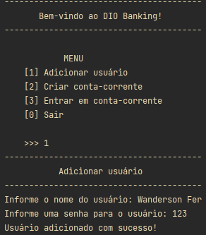
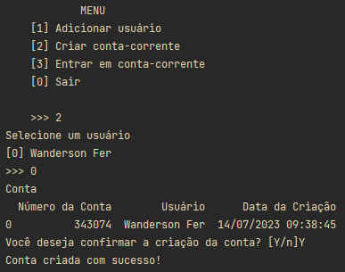
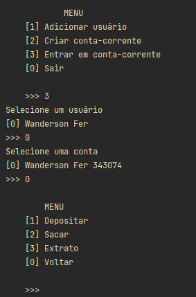

# System Banking DIO with Pandas


## Descrição

### Desafio

Fomos contratados por um grande banco para desenvolver o seu novo sistema. Esse banco deseja modernizar as suas operações e para isso escolheu a linguagem Python. Para a primeira versão do sistema devemos implementar apenas 3 operações: depósito, saque e extrato.

- Depósito
    
    Deve ser possível depositar valores positivos para a minha conta bancária. A v1 do projeto trabalha apenas com 1 usuário, dessa forma não precisamos preocupar-nos em identificar qual é o número da agência e conta bancaria. Todos os depósitos devem ser armazenados numa variável e exibidos na operação de extrato.
    
- Saque
    
    O sistema deve permitir realizar 3 saques diários com **limite máximo** de R$ 500,00 por saque. Caso o usuário não tenha saldo em conta, o sistema deve exibir uma mensagem informando que não será possível sacar o dinheiro por **falta de salto**. Todos os saques devem ser armazenados numa variável e exibidos na operação de extrato.
    
- Extrato
    
    Essa operação deve listar todos os depósitos e saques realizados na conta. No fim da listagem deve ser exibido o saldo atual da conta.

#### Uma otimização foi solicitada para adicionar as seguintes funções

- Adicionar usuário

    O sistema deve cadastrar usuários e armazenar essas informações.

- Criar conta-corrente

    O sistema deve cadastrar e armazenar informações de contas.

## Adicionar usuário


> Tela de cadastro de usuário 

## Adicionar conta


> Tela de cadastro de conta
 
## Entrar em uma conta


> Tela de ingresso na conta cadastrada

## Depósito


> Tela de depósito

## Saque


> Tela de saque

## Extrato


> Tela de extrato


## 💻 Pré-requisitos

* É necessário ter instalado `Python 3.11`
* Biblioteca `Pandas 2.0.3`, pode ser instalada usando `pip install pandas==2.0.3` 

## Usando o System Banking DIO

Visto que todas as dependências estejam instaladas execute o [main.py](main.py)
ou digite no prompt:

``` PowerShell
    python main.py
```

## Author

### Wanderson G. Fernandes
- [Instagram](https://instagram.com/locke._.wanderson?igshid=ZDc4ODBmNjlmNQ==)
- [LinkedIn](https://www.linkedin.com/in/wanderson-guedes-3138851aa)

## 📝 Licença

Esse projeto está sob licença MIT. Veja o arquivo [LICENÇA](LICENSE.md) para mais detalhes.
