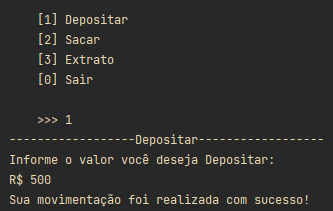
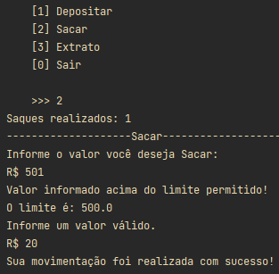

# System Banking DIO with Pandas


## Deposito


> Tela de depósito

## Saque


> Tela de saque


## Extrato


> Tela de extrato


## 💻 Pré-requisitos

* É necessário ter instalado `Python 3.11`
* Biblioteca `Pandas 2.0.3`, pode ser instalada usando `pip install pandas==2.0.3` 

## Usando o System Banking DIO

Visto que todas as dependências estejam instaladas execute o [main.py](main.py)
ou digite no prompt:

``` PowerShell
    python main.py
```

## Author

### Wanderson G. Fernandes
- [Instagram](https://instagram.com/locke._.wanderson?igshid=ZDc4ODBmNjlmNQ==)
- [LinkedIn](https://www.linkedin.com/in/wanderson-guedes-3138851aa)

## 📝 Licença

Esse projeto está sob licença. Veja o arquivo [LICENÇA](LICENSE.md) para mais detalhes.

[⬆ Voltar ao topo](#System Banking DIO with Pandas)

